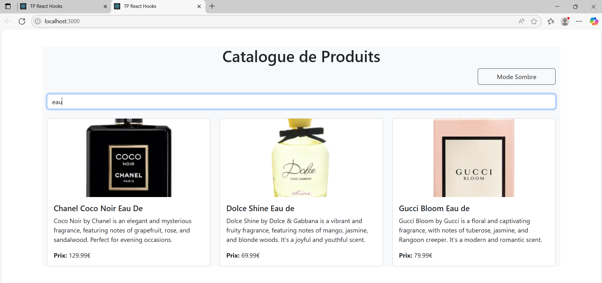

# TP React Hooks - Application de Gestion de Produits

Ce TP a pour objectif de mettre en pratique l'utilisation des Hooks React (useState, useEffect, useContext) ainsi que la création de Hooks personnalisés.

## Installation et configuration initiale

1. Cloner le dépôt :
```bash
git clone https://github.com/pr-daaif/tp-react-hooks.git
cd tp-react-hooks
```

2. Créer votre propre dépôt sur Github et changer le remote :
```bash
# Supprimer le remote origine
git remote remove origin

# Ajouter votre nouveau remote
git remote add origin https://github.com/[votre-username]/tp-react-hooks.git

# Premier push
git push -u origin main
```

3. Installer les dépendances :
```bash
npm install
```

4. Lancer l'application :
```bash
npm start
```

## Instructions pour le TP

Pour chaque exercice :
1. Lisez attentivement l'énoncé
2. Implémentez la solution
3. Testez votre implémentation (pensez à faire des copies d'écran)
4. Mettez à jour la section correspondante dans ce README avec :
   - Une brève explication de votre solution
   - Des captures d'écran montrant le fonctionnement
   - Les difficultés rencontrées et comment vous les avez résolues
5. Commitez vos changements avec un message descriptif

### Exercice 1 : État et Effets 
#### Objectif : Implémenter une recherche en temps réel

- [ ] 1.1 Modifier le composant ProductSearch pour utiliser la recherche
- [ ] 1.2 Implémenter le debounce sur la recherche
- [ ] 1.3 Documenter votre solution ici

#### Réponse :

 [ ] 1.1 Modifier le composant ProductSearch pour utiliser la recherche


- [ ] 1.2 Implémenter le debounce sur la recherche


- [ ] 1.3 Documenter votre solution ici

-  - Connexion à la recherche :
Le composant ProductSearch prend en props searchTerm et setSearchTerm, ce qui permet d’envoyer le terme de recherche vers le parent. Le composant ProductList utilise ce searchTerm pour filtrer les produits à afficher.

   - Débounce :
Nous avons ajouté un useEffect dans ProductSearch qui utilise setTimeout pour différer la mise à jour de searchTerm. Cela permet d’attendre 1 seconde après la dernière frappe de l’utilisateur avant de déclencher la recherche. Ce mécanisme de "debounce" améliore l’expérience utilisateur et les performances, notamment lorsqu’on interagit avec une API ou un grand nombre de produits.

   - Résultat :
Lorsque l’utilisateur saisit une recherche :
      - La mise à jour du champ se fait immédiatement via debouncedSearchTerm.
      - Après 1 seconde d’inactivité, setSearchTerm est appelé.
      - Le composant ProductList filtre les produits à afficher en fonction de ce terme.


### Exercice 2 : Context et Internationalisation
#### Objectif : Gérer les préférences de langue

- [ ] 2.1 Créer le LanguageContext
- [ ] 2.2 Ajouter le sélecteur de langue
- [ ] 2.3 Documenter votre solution ici

#### Réponse :

- [ ] 2.1 Créer le LanguageContext

Nous avons créé un contexte React LanguageContext pour stocker la langue choisie (fr ou en). Ce contexte contient la variable language ainsi qu’un setter setLanguage, et est exposé à l’ensemble de l’application via un LanguageContext.Provider dans App.js.

- [ ] 2.2 Ajouter le sélecteur de langue

- le site en français


- le site en anglais


- [ ] 2.3 Documenter votre solution ici

Nous avons implémenté un composant LanguageSelector avec une liste déroulante permettant de sélectionner la langue. Lorsqu’une langue est choisie, elle est mise à jour dans le contexte. Tous les composants enfants peuvent ensuite accéder à cette valeur via useContext(LanguageContext).


### Exercice 3 : Hooks Personnalisés
#### Objectif : Créer des hooks réutilisables

- [ ] 3.1 Créer le hook useDebounce
- [ ] 3.2 Créer le hook useLocalStorage
- [ ] 3.3 Documenter votre solution ici

#### Réponse :

- [ ] 3.1 Créer le hook useDebounce


- [ ] 3.2 Créer le hook useLocalStorage


- [ ] 3.3 Documenter votre solution 

Version anglaise avec prise en charge du stockage local


Version française avec prise en charge du stockage local


### Exercice 4 : Gestion Asynchrone et Pagination
#### Objectif : Gérer le chargement et la pagination

- [ ] 4.1 Ajouter le bouton de rechargement
- [ ] 4.2 Implémenter la pagination
- [ ] 4.3 Documenter votre solution ici

#### Réponse :
- [ ] 4.1 Ajouter le bouton de rechargement


- [ ] 4.2 Implémenter la pagination

Premiere page


Deuxiéme page


## Rendu

- Ajoutez l'URL de votre dépôt Github dans  **Classroom** et envoyer la réponse dès le démarage de votre projet.
- Les push doivent se faire au fûr et à mesure que vous avancez dans votre projet.
- Le README.md doit être à jour avec vos réponses et captures d'écran. 
- Chaques exercice doit faire l'objet d'au moins un commit avec un message mentionnant le numéro de l'exercice.